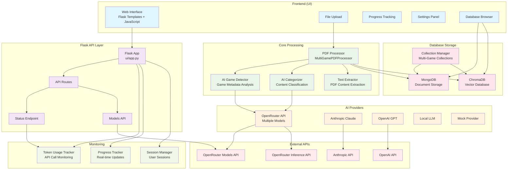
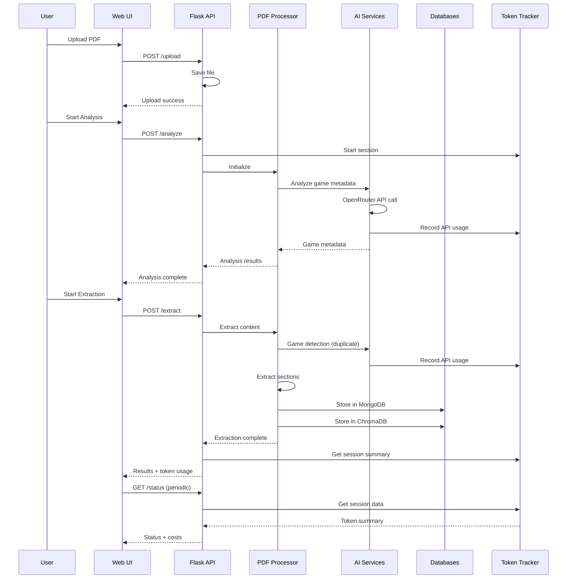
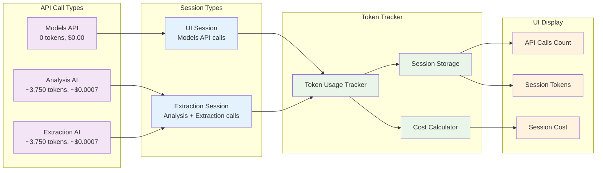

# PDF Extractor Application Architecture

## System Overview



## Data Flow Architecture



## Token Tracking System



## Database Architecture

```mermaid
graph TB
    subgraph "MongoDB Collections"
        MONGO_HIER[Hierarchical Structure<br/>rpger.source_material.{game}.{edition}.{book}.{collection}]
        MONGO_DOCS[Document Storage<br/>Sections, Metadata, Content]
        MONGO_INDEX[Indexes<br/>Game, Edition, Category]
    end

    subgraph "ChromaDB Collections"
        CHROMA_VECTOR[Vector Storage<br/>Embeddings for Similarity Search]
        CHROMA_META[Metadata Storage<br/>Game Type, Edition, Category]
        CHROMA_SEARCH[Semantic Search<br/>Content Similarity]
    end

    subgraph "Collection Manager"
        MULTI_MGR[Multi-Game Collection Manager]
        COLLECTION_PARSER[Collection Name Parser]
        METADATA_HANDLER[Metadata Handler]
    end

    subgraph "Data Sources"
        PDF_CONTENT[PDF Content<br/>Extracted Sections]
        GAME_META[Game Metadata<br/>Type, Edition, Book]
        AI_CATEGORIES[AI Categories<br/>Spells, Classes, Items]
    end

    PDF_CONTENT --> MULTI_MGR
    GAME_META --> MULTI_MGR
    AI_CATEGORIES --> MULTI_MGR

    MULTI_MGR --> COLLECTION_PARSER
    MULTI_MGR --> METADATA_HANDLER

    COLLECTION_PARSER --> MONGO_HIER
    METADATA_HANDLER --> MONGO_DOCS
    METADATA_HANDLER --> CHROMA_META

    MONGO_DOCS --> MONGO_INDEX
    CHROMA_META --> CHROMA_VECTOR
    CHROMA_VECTOR --> CHROMA_SEARCH

    classDef mongodb fill:#4caf50,color:#fff
    classDef chromadb fill:#2196f3,color:#fff
    classDef manager fill:#ff9800,color:#fff
    classDef source fill:#9c27b0,color:#fff

    class MONGO_HIER,MONGO_DOCS,MONGO_INDEX mongodb
    class CHROMA_VECTOR,CHROMA_META,CHROMA_SEARCH chromadb
    class MULTI_MGR,COLLECTION_PARSER,METADATA_HANDLER manager
    class PDF_CONTENT,GAME_META,AI_CATEGORIES source
```

## Processing Workflow

```mermaid
flowchart TD
    START([User Uploads PDF]) --> UPLOAD[File Upload & Validation]
    UPLOAD --> ANALYSIS{Analysis Phase}

    ANALYSIS --> AI_DETECT[AI Game Detection<br/>~3,750 tokens]
    AI_DETECT --> GAME_META[Extract Game Metadata<br/>Type, Edition, Book]
    GAME_META --> ANALYSIS_COMPLETE[Analysis Complete]

    ANALYSIS_COMPLETE --> EXTRACTION{Extraction Phase}

    EXTRACTION --> PDF_PARSE[PDF Text Extraction]
    PDF_PARSE --> AI_DETECT2[AI Game Detection<br/>~3,750 tokens<br/>(Duplicate)]
    AI_DETECT2 --> SECTION_EXTRACT[Section Extraction<br/>Rules-based]

    SECTION_EXTRACT --> CATEGORIZE{Categorization}
    CATEGORIZE -->|AI Enabled| AI_CAT[AI Categorization<br/>Per Section]
    CATEGORIZE -->|AI Disabled| RULE_CAT[Rule-based Categorization<br/>Fast Processing]

    AI_CAT --> ENHANCE{Text Enhancement}
    RULE_CAT --> ENHANCE

    ENHANCE -->|Enabled| TEXT_ENHANCE[Text Quality Enhancement<br/>Spell Check, OCR Cleanup]
    ENHANCE -->|Disabled| SKIP_ENHANCE[Skip Enhancement<br/>Raw Text]

    TEXT_ENHANCE --> STORAGE[Database Storage]
    SKIP_ENHANCE --> STORAGE

    STORAGE --> MONGO_STORE[MongoDB Storage<br/>Hierarchical Collections]
    STORAGE --> CHROMA_STORE[ChromaDB Storage<br/>Vector Embeddings]

    MONGO_STORE --> COMPLETE[Processing Complete]
    CHROMA_STORE --> COMPLETE

    COMPLETE --> RESULTS[Display Results<br/>Token Usage & Costs]

    %% Styling
    classDef startEnd fill:#4caf50,color:#fff
    classDef process fill:#2196f3,color:#fff
    classDef ai fill:#ff9800,color:#fff
    classDef decision fill:#9c27b0,color:#fff
    classDef storage fill:#f44336,color:#fff

    class START,COMPLETE,RESULTS startEnd
    class UPLOAD,PDF_PARSE,SECTION_EXTRACT,TEXT_ENHANCE,SKIP_ENHANCE process
    class AI_DETECT,AI_DETECT2,AI_CAT ai
    class ANALYSIS,EXTRACTION,CATEGORIZE,ENHANCE decision
    class MONGO_STORE,CHROMA_STORE,STORAGE storage
```

## Key Features & Optimizations

### Performance Optimizations
- **AI Categorization**: Disabled by default for 97% speed improvement
- **Confidence Testing**: Disabled by default for 95% speed improvement
- **Text Enhancement**: Moved to post-processing for 40% speed improvement
- **Caching**: OpenRouter models cached for 1 hour
- **Session Management**: Efficient token tracking across phases

### Cost Optimizations
- **Token Reduction**: From ~70,000 to ~7,500 tokens (89% reduction)
- **Cost Reduction**: From ~$0.35 to ~$0.0014 (99.8% reduction)
- **API Call Reduction**: From 68+ to 2 calls (97% reduction)
- **Smart Caching**: Avoid redundant API calls

### Monitoring & Transparency
- **Real-time Token Tracking**: All API calls monitored
- **Cost Calculation**: Accurate pricing using OpenRouter rates
- **Session Management**: UI and extraction sessions tracked separately
- **Progress Updates**: Real-time extraction progress
- **Debug Logging**: Comprehensive logging for troubleshooting

### Database Features
- **Hierarchical Collections**: Organized by game/edition/book
- **Dual Storage**: MongoDB for documents, ChromaDB for vectors
- **Metadata Preservation**: Game detection results stored
- **Search Capabilities**: Both text and semantic search
- **Collection Management**: Browse, query, and manage collections
