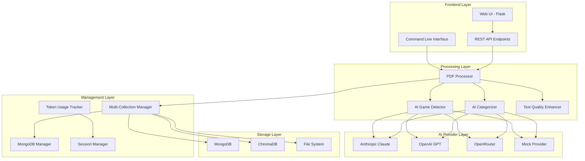
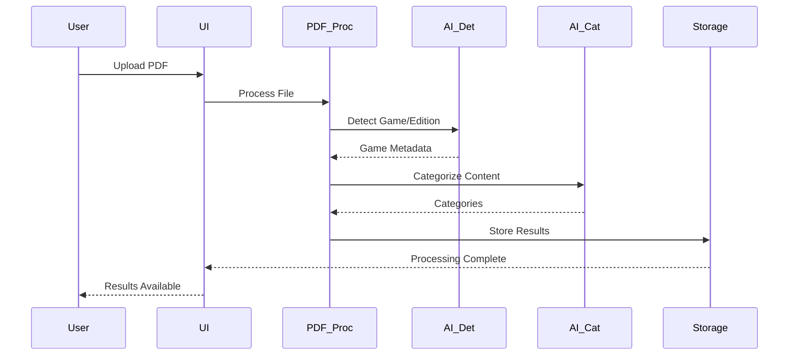
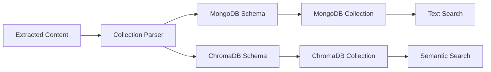

# Architecture Overview

## System Architecture

The RPGer Content Extractor follows a modular, microservices-inspired architecture designed for scalability, maintainability, and flexibility. The system is built around a core processing pipeline with pluggable AI providers and dual database storage.

## High-Level Architecture

## Core Components

### 1. Frontend Layer

#### Web UI (Flask Application)
- **Location**: `ui/app.py`
- **Purpose**: User-friendly web interface for PDF processing
- **Features**: 
  - Drag-and-drop file upload
  - Real-time processing progress
  - Database browsing and management
  - System health monitoring
- **Technology**: Flask, Bootstrap, JavaScript

#### Command Line Interface
- **Location**: `Extraction.py`
- **Purpose**: Batch processing and automation
- **Features**:
  - Single PDF extraction
  - Batch directory processing
  - Database import/export
  - Collection management
- **Usage**: Production automation and scripting

#### REST API
- **Purpose**: Programmatic access to all functionality
- **Endpoints**: 50+ endpoints for complete system control
- **Features**: File upload, analysis, extraction, database operations

### 2. Processing Layer

#### PDF Processor (`Modules/pdf_processor.py`)
- **Purpose**: Core PDF content extraction engine
- **Features**:
  - Multi-column layout detection
  - Text extraction with formatting preservation
  - Table detection and extraction
  - Metadata extraction
- **Technology**: PyMuPDF (fitz), pdfplumber

#### AI Game Detector (`Modules/ai_game_detector.py`)
- **Purpose**: Intelligent game system and edition detection
- **Features**:
  - Multi-provider AI analysis
  - Confidence scoring
  - Fallback detection methods
  - Support for 10+ RPG systems

#### AI Categorizer (`Modules/ai_categorizer.py`)
- **Purpose**: Content classification and categorization
- **Features**:
  - Context-aware categorization
  - Game-specific category mapping
  - Confidence scoring
  - Hierarchical classification

#### Text Quality Enhancer (`Modules/text_quality_enhancer.py`)
- **Purpose**: Text cleanup and formatting improvement
- **Features**:
  - OCR error correction
  - Formatting standardization
  - Quality scoring
  - Automated text improvement

### 3. AI Provider Layer

#### Multi-Provider Architecture
- **Design**: Pluggable provider system with unified interface
- **Providers**: Anthropic Claude, OpenAI GPT, OpenRouter (300+ models), Mock
- **Features**: Automatic failover, cost tracking, rate limiting

#### Provider Implementations
- **Anthropic**: Primary provider for high-quality analysis
- **OpenAI**: Alternative provider with multiple model options
- **OpenRouter**: Access to diverse model ecosystem
- **Mock**: Testing and development without API costs

### 4. Storage Layer

#### Dual Database Architecture
The system employs a sophisticated dual database approach:

**MongoDB (Document Storage)**
- **Purpose**: Traditional document storage and querying
- **Schema**: Hierarchical collection organization
- **Features**: Full-text search, aggregation, indexing

**ChromaDB (Vector Storage)**
- **Purpose**: Semantic search and similarity matching
- **Features**: Vector embeddings, similarity search, metadata filtering
- **Use Cases**: Content discovery, duplicate detection

#### File System Storage
- **Purpose**: Temporary file handling and output generation
- **Features**: Secure upload handling, output file management
- **Formats**: JSON, ChromaDB format, raw text

### 5. Management Layer

#### Multi-Collection Manager (`Modules/multi_collection_manager.py`)
- **Purpose**: Unified database operations across both storage systems
- **Features**:
  - Collection discovery and organization
  - Cross-database synchronization
  - Metadata management
  - Query coordination

#### MongoDB Manager (`Modules/mongodb_manager.py`)
- **Purpose**: MongoDB-specific operations and schema management
- **Features**:
  - Hierarchical collection naming
  - Document validation
  - Index management
  - Query optimization

#### Token Usage Tracker (`Modules/token_usage_tracker.py`)
- **Purpose**: AI API cost monitoring and session management
- **Features**:
  - Real-time cost calculation
  - Session-based tracking
  - Provider-specific metrics
  - Budget monitoring

## Data Flow Architecture

### 1. PDF Processing Pipeline

### 2. Database Storage Flow

## Scalability Design

### Horizontal Scaling
- **Stateless Components**: All processing components are stateless
- **Database Separation**: Databases can be scaled independently
- **Load Balancing**: Multiple instances can run behind load balancer

### Vertical Scaling
- **Memory Optimization**: Streaming processing for large files
- **CPU Utilization**: Parallel processing where possible
- **Storage Efficiency**: Compressed storage and efficient indexing

### Container Architecture
- **Microservices Ready**: Each component can be containerized separately
- **Docker Compose**: Multi-container orchestration
- **Health Checks**: Built-in health monitoring for all services

## Security Architecture

### Input Validation
- **File Type Validation**: Only PDF files accepted
- **Size Limits**: 200MB maximum file size
- **Content Scanning**: Malware detection capabilities

### Data Protection
- **Temporary Storage**: Secure temporary file handling
- **API Key Management**: Environment-based configuration
- **Access Control**: Role-based access (future enhancement)

### Network Security
- **HTTPS Support**: SSL/TLS encryption
- **CORS Configuration**: Cross-origin request management
- **Rate Limiting**: API abuse prevention

## Performance Characteristics

### Processing Performance
- **Large Files**: Optimized for files up to 200MB
- **Memory Usage**: Streaming processing to minimize memory footprint
- **Processing Speed**: Parallel AI analysis where possible

### Database Performance
- **MongoDB**: Indexed queries for fast retrieval
- **ChromaDB**: Optimized vector operations
- **Caching**: Intelligent caching of AI responses

### API Performance
- **Response Times**: Sub-second for most operations
- **Throughput**: Designed for concurrent users
- **Monitoring**: Real-time performance metrics

## Monitoring and Observability

### Health Monitoring
- **System Health**: `/health` endpoint for service monitoring
- **Database Health**: Connection and performance monitoring
- **AI Provider Health**: API availability and response time tracking

### Logging
- **Structured Logging**: JSON-formatted logs for analysis
- **Log Levels**: Configurable logging levels
- **Audit Trail**: Complete operation tracking

### Metrics
- **Token Usage**: Real-time AI API cost tracking
- **Processing Metrics**: File processing statistics
- **Error Tracking**: Comprehensive error monitoring

## Technology Stack

### Backend
- **Python 3.12**: Core runtime environment
- **Flask**: Web framework and API server
- **PyMuPDF**: PDF processing library
- **pymongo**: MongoDB driver
- **chromadb**: Vector database client

### Frontend
- **HTML5/CSS3**: Modern web standards
- **Bootstrap 5**: Responsive UI framework
- **JavaScript**: Interactive functionality
- **WebSockets**: Real-time updates

### Databases
- **MongoDB**: Document database
- **ChromaDB**: Vector database
- **File System**: Temporary storage

### DevOps
- **Docker**: Containerization
- **Docker Compose**: Multi-container orchestration
- **Jenkins**: CI/CD pipeline
- **pytest**: Testing framework

## Future Architecture Considerations

### Microservices Migration
- **Service Decomposition**: Split into independent services
- **API Gateway**: Centralized API management
- **Service Discovery**: Dynamic service registration

### Cloud Native
- **Kubernetes**: Container orchestration
- **Cloud Databases**: Managed database services
- **Serverless**: Function-based processing

### Advanced Features
- **Machine Learning**: Custom model training
- **Real-time Processing**: Stream processing capabilities
- **Multi-tenancy**: Support for multiple organizations
