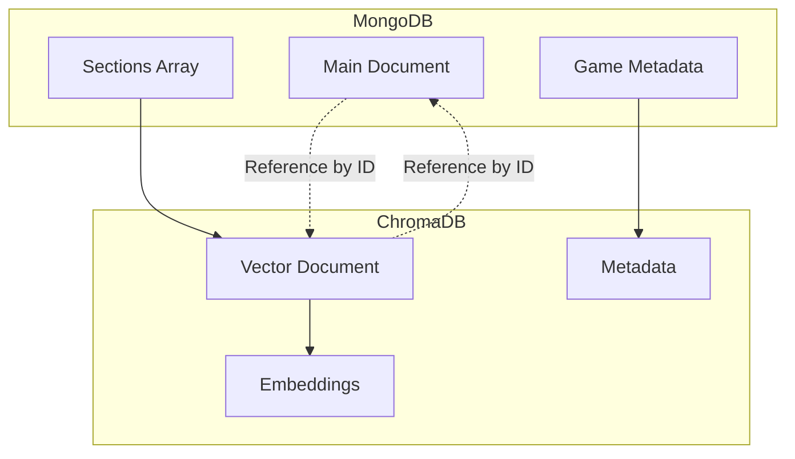

# Database Schema

## Overview

The RPGer Content Extractor uses a dual database architecture combining MongoDB for document storage and ChromaDB for vector-based semantic search. This design provides both traditional querying capabilities and advanced AI-powered content discovery.

## MongoDB Schema

### Database Structure

**Database Name**: `rpger`

### Collection Naming Convention

Collections follow a hierarchical naming pattern:
```
rpger.source_material.{game_type}.{edition}.{book_type}.{collection_name}
```

**Examples**:
- `rpger.source_material.dnd.5th_edition.phb.core_rules`
- `rpger.source_material.pathfinder.2nd_edition.crb.character_creation`
- `rpger.source_material.call_of_cthulhu.7th_edition.keeper.investigation_rules`

### Document Schema

#### Main Document Structure

```json
{
  "_id": "unique_document_identifier",
  "import_date": "2025-10-18T10:30:00.000Z",
  "game_metadata": {
    "game_type": "D&D",
    "edition": "5th Edition",
    "book_type": "PHB",
    "book_full_name": "Player's Handbook",
    "collection_name": "dnd_5e_phb_core",
    "confidence": 0.98,
    "detection_method": "ai_analysis"
  },
  "sections": [
    {
      "title": "Character Creation",
      "content": "Full text content of the section...",
      "page": 13,
      "category": "Character",
      "subcategory": "Creation",
      "has_tables": true,
      "table_count": 2,
      "is_multi_column": true,
      "word_count": 1250,
      "confidence": 0.95
    }
  ],
  "summary": {
    "total_pages": 320,
    "total_words": 125000,
    "total_sections": 45,
    "total_tables": 15,
    "categories": ["Character", "Spells", "Equipment", "Combat"]
  },
  "source_file": "players_handbook_5e.pdf",
  "extraction_method": "ai_powered_v3",
  "processing_metadata": {
    "ai_provider": "anthropic",
    "ai_model": "claude-3-sonnet",
    "processing_time": 185.7,
    "token_usage": {
      "input_tokens": 18500,
      "output_tokens": 650,
      "cost": 0.32
    }
  }
}
```

#### Individual Section Documents (Alternative Schema)

For granular access, sections can be stored as individual documents:

```json
{
  "_id": "dnd_5e_phb_page_13_section_1",
  "source": "Player's Handbook",
  "title": "Character Creation",
  "content": "Full text content...",
  "page": 13,
  "category": "Character",
  "tags": ["character", "creation", "stats", "races"],
  "word_count": 1250,
  "has_tables": true,
  "table_count": 2,
  "is_multi_column": true,
  "game_metadata": {
    "game_type": "D&D",
    "edition": "5th Edition",
    "book_type": "PHB"
  },
  "extraction_metadata": {
    "extraction_method": "ai_powered_v3",
    "ai_provider": "anthropic",
    "confidence": 0.95,
    "created_at": "2025-10-18T10:30:00.000Z"
  }
}
```

### Indexes

#### Primary Indexes
```javascript
// Game type and edition index
db.collection.createIndex({ 
  "game_metadata.game_type": 1, 
  "game_metadata.edition": 1 
})

// Category index for content filtering
db.collection.createIndex({ 
  "sections.category": 1 
})

// Text search index
db.collection.createIndex({ 
  "sections.title": "text", 
  "sections.content": "text" 
})

// Page number index for navigation
db.collection.createIndex({ 
  "sections.page": 1 
})
```

#### Compound Indexes
```javascript
// Game-specific content search
db.collection.createIndex({
  "game_metadata.game_type": 1,
  "game_metadata.edition": 1,
  "sections.category": 1
})

// Import date and processing method
db.collection.createIndex({
  "import_date": -1,
  "extraction_method": 1
})
```

### Query Patterns

#### Find by Game and Edition
```javascript
db.collection.find({
  "game_metadata.game_type": "D&D",
  "game_metadata.edition": "5th Edition"
})
```

#### Search Content by Category
```javascript
db.collection.find({
  "sections.category": "Spells",
  "game_metadata.game_type": "D&D"
})
```

#### Full-Text Search
```javascript
db.collection.find({
  $text: { $search: "fireball spell damage" }
})
```

#### Aggregation for Statistics
```javascript
db.collection.aggregate([
  {
    $match: { "game_metadata.game_type": "D&D" }
  },
  {
    $group: {
      _id: "$game_metadata.edition",
      total_documents: { $sum: 1 },
      total_pages: { $sum: "$summary.total_pages" },
      total_words: { $sum: "$summary.total_words" }
    }
  }
])
```

## ChromaDB Schema

### Collection Structure

ChromaDB collections are organized by game type and edition:
- `dnd_5e_source_materials`
- `pathfinder_2e_core_rules`
- `call_of_cthulhu_7e_scenarios`

### Document Format

```json
{
  "id": "dnd_5e_phb_section_13_1",
  "document": "Character Creation: When creating a character...",
  "metadata": {
    "game_type": "D&D",
    "edition": "5th Edition",
    "book_type": "PHB",
    "source": "Player's Handbook",
    "title": "Character Creation",
    "page": 13,
    "category": "Character",
    "subcategory": "Creation",
    "word_count": 1250,
    "has_tables": true,
    "confidence": 0.95,
    "import_date": "2025-10-18T10:30:00.000Z",
    "extraction_method": "ai_powered_v3"
  },
  "embedding": [0.1, 0.2, -0.3, ...] // Vector embedding (auto-generated)
}
```

### Metadata Schema

#### Required Metadata Fields
- `game_type`: Game system identifier
- `edition`: Game edition
- `source`: Source book name
- `title`: Section title
- `page`: Page number
- `category`: Content category

#### Optional Metadata Fields
- `subcategory`: Detailed categorization
- `book_type`: Book type (PHB, DMG, MM, etc.)
- `word_count`: Section word count
- `has_tables`: Boolean for table presence
- `confidence`: AI confidence score
- `tags`: Array of content tags

### Query Operations

#### Similarity Search
```python
# Find similar content
results = collection.query(
    query_texts=["character creation rules"],
    n_results=10,
    where={"game_type": "D&D"}
)
```

#### Metadata Filtering
```python
# Filter by specific criteria
results = collection.query(
    query_texts=["spell casting"],
    n_results=5,
    where={
        "$and": [
            {"game_type": {"$eq": "D&D"}},
            {"category": {"$eq": "Spells"}},
            {"edition": {"$eq": "5th Edition"}}
        ]
    }
)
```

#### Get Documents by ID
```python
# Retrieve specific documents
results = collection.get(
    ids=["dnd_5e_phb_section_13_1"],
    include=["documents", "metadatas"]
)
```

## Data Relationships

### Cross-Database Relationships



### ID Mapping Strategy

**MongoDB Document ID**: `{collection_name}_{unique_identifier}`
**ChromaDB Document ID**: `{game_type}_{edition}_{book}_{section}_{index}`

**Example Mapping**:
- MongoDB: `dnd_5e_phb_core_rules_001`
- ChromaDB: `dnd_5e_phb_section_13_1`

## Data Migration and Synchronization

### MongoDB to ChromaDB Migration

```python
def migrate_to_chromadb(mongo_doc):
    """Convert MongoDB document to ChromaDB format"""
    chroma_docs = []
    
    for i, section in enumerate(mongo_doc['sections']):
        chroma_doc = {
            'id': f"{mongo_doc['game_metadata']['collection_name']}_section_{section['page']}_{i}",
            'document': section['content'],
            'metadata': {
                **mongo_doc['game_metadata'],
                'title': section['title'],
                'page': section['page'],
                'category': section['category'],
                'word_count': section['word_count'],
                'has_tables': section.get('has_tables', False)
            }
        }
        chroma_docs.append(chroma_doc)
    
    return chroma_docs
```

### ChromaDB to MongoDB Migration

```python
def migrate_to_mongodb(chroma_results, collection_name):
    """Convert ChromaDB results to MongoDB format"""
    mongo_docs = []
    
    for result in chroma_results:
        mongo_doc = {
            '_id': f"{collection_name}_{result['id']}",
            'source': result['metadata']['source'],
            'title': result['metadata']['title'],
            'content': result['document'],
            'page': result['metadata']['page'],
            'category': result['metadata']['category'],
            'metadata': {
                'extraction_method': 'chromadb_transfer',
                'original_collection': collection_name,
                'original_id': result['id'],
                'transfer_date': datetime.now().isoformat()
            }
        }
        mongo_docs.append(mongo_doc)
    
    return mongo_docs
```

## Performance Optimization

### MongoDB Optimization

#### Index Strategy
- **Compound indexes** for common query patterns
- **Text indexes** for full-text search
- **Sparse indexes** for optional fields
- **TTL indexes** for temporary data

#### Query Optimization
- **Projection** to limit returned fields
- **Aggregation pipelines** for complex queries
- **Explain plans** for query analysis
- **Connection pooling** for concurrent access

### ChromaDB Optimization

#### Collection Management
- **Separate collections** by game type for better performance
- **Metadata filtering** to reduce search space
- **Batch operations** for bulk imports
- **Embedding caching** for repeated queries

#### Vector Operations
- **Similarity thresholds** to limit results
- **Metadata pre-filtering** before vector search
- **Batch queries** for multiple searches
- **Index optimization** for large collections

## Backup and Recovery

### MongoDB Backup Strategy
```bash
# Full database backup
mongodump --db rpger --out /backup/mongodb/

# Collection-specific backup
mongodump --db rpger --collection specific_collection --out /backup/

# Restore from backup
mongorestore --db rpger /backup/mongodb/rpger/
```

### ChromaDB Backup Strategy
```python
# Export collection data
def backup_chromadb_collection(collection_name):
    collection = client.get_collection(collection_name)
    data = collection.get(include=['documents', 'metadatas', 'embeddings'])
    
    with open(f'backup_{collection_name}.json', 'w') as f:
        json.dump(data, f)

# Restore collection data
def restore_chromadb_collection(collection_name, backup_file):
    with open(backup_file, 'r') as f:
        data = json.load(f)
    
    collection = client.create_collection(collection_name)
    collection.add(
        ids=data['ids'],
        documents=data['documents'],
        metadatas=data['metadatas'],
        embeddings=data['embeddings']
    )
```

## Schema Evolution

### Version Management
- **Schema versioning** in document metadata
- **Migration scripts** for schema updates
- **Backward compatibility** for older documents
- **Gradual migration** strategies

### Future Enhancements
- **Multi-language support** in metadata
- **Enhanced categorization** with AI-generated tags
- **Cross-reference tracking** between documents
- **User annotation** and rating systems
