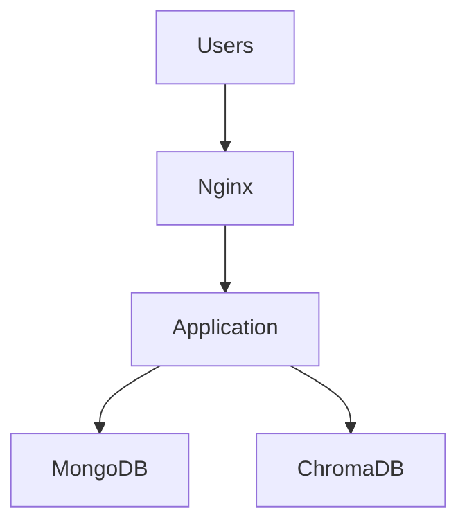

# Docker Deployment Guide

## Overview

This guide covers all Docker deployment options for the RPGer Content Extractor, from simple single-container deployments to full production environments with external databases and load balancing.

## Deployment Options

### 1. Production Mode (Recommended)
- Pre-built Docker images
- External database connections
- Optimized for performance and reliability
- Suitable for production environments

### 2. Development Mode
- Source code mounting for live reloading
- Built-in debugging capabilities
- Ideal for development and testing

### 3. Full Stack Mode
- Self-contained deployment with all services
- Includes MongoDB and ChromaDB containers
- Perfect for demos and isolated environments

### 4. Hybrid Mode
- Mix of containerized and external services
- Flexible configuration options
- Customizable for specific requirements

## Prerequisites

### System Requirements

**Minimum Requirements**:
- Docker Engine 20.10+
- Docker Compose 2.0+
- 2GB RAM
- 4GB disk space
- Linux, macOS, or Windows with WSL2

**Recommended Requirements**:
- Docker Engine 24.0+
- Docker Compose 2.20+
- 8GB RAM
- 20GB disk space
- SSD storage for database volumes

### Software Installation

#### Docker Engine Installation

**Ubuntu/Debian**:
```bash
# Update package index
sudo apt update

# Install Docker
curl -fsSL https://get.docker.com -o get-docker.sh
sudo sh get-docker.sh

# Add user to docker group
sudo usermod -aG docker $USER
newgrp docker

# Verify installation
docker --version
docker-compose --version
```

**CentOS/RHEL**:
```bash
# Install Docker
sudo yum install -y yum-utils
sudo yum-config-manager --add-repo https://download.docker.com/linux/centos/docker-ce.repo
sudo yum install docker-ce docker-ce-cli containerd.io docker-compose-plugin

# Start Docker service
sudo systemctl start docker
sudo systemctl enable docker

# Add user to docker group
sudo usermod -aG docker $USER
```

**macOS**:
```bash
# Install Docker Desktop
brew install --cask docker

# Or download from https://www.docker.com/products/docker-desktop
```

**Windows**:
- Download Docker Desktop from https://www.docker.com/products/docker-desktop
- Enable WSL2 integration
- Install in WSL2 environment for best performance

## Quick Start Deployment

### 1. One-Line Installation

```bash
# Download and run installation script
curl -sSL https://raw.githubusercontent.com/PadsterH2012/rpger-content-extractor/main/install.sh | bash
```

This script will:
- Download necessary files
- Configure environment
- Start services
- Provide access URLs

### 2. Manual Quick Start

```bash
# Clone repository
git clone https://github.com/PadsterH2012/rpger-content-extractor.git
cd rpger-content-extractor

# Copy environment template
cp .env.example .env

# Edit configuration (add AI API keys)
nano .env

# Start production deployment
docker-compose up -d

# Verify deployment
curl http://localhost:5000/health
```

## Production Deployment

### 1. Environment Configuration

#### Create Production Environment File

```bash
# Create production environment file
cat > .env << EOF
# Production Configuration
FLASK_ENV=production
FLASK_SECRET_KEY=$(openssl rand -hex 32)
MAX_CONTENT_LENGTH=200
UPLOAD_TIMEOUT=300

# AI Provider Configuration (choose one or more)
ANTHROPIC_API_KEY=your-anthropic-api-key
OPENAI_API_KEY=your-openai-api-key
OPENROUTER_API_KEY=your-openrouter-api-key

# Database Configuration (external databases)
MONGODB_HOST=your-mongodb-host
MONGODB_PORT=27017
MONGODB_DATABASE=rpger
MONGODB_USERNAME=rpger_user
MONGODB_PASSWORD=secure_password

CHROMA_HOST=your-chromadb-host
CHROMA_PORT=8000
CHROMA_TENANT=default_tenant
CHROMA_DATABASE=default_database

# Security Configuration
CORS_ORIGINS=https://yourdomain.com,https://app.yourdomain.com
RATE_LIMIT_STORAGE_URL=redis://redis:6379

# Monitoring Configuration
LOG_LEVEL=INFO
SENTRY_DSN=your-sentry-dsn
METRICS_ENABLED=true
EOF
```

#### Secure Environment File

```bash
# Set secure permissions
chmod 600 .env

# Verify no secrets in git
echo ".env" >> .gitignore
```

### 2. Production Docker Compose

#### Basic Production Setup

```yaml
# docker-compose.prod.yml
version: '3.8'

services:
  app:
    image: padster2012/rpger-content-extractor:latest
    ports:
      - "5000:5000"
    environment:
      - FLASK_ENV=production
    env_file:
      - .env
    volumes:
      - ./uploads:/app/uploads
      - ./extracted:/app/extracted
      - ./logs:/app/logs
    restart: unless-stopped
    healthcheck:
      test: ["CMD", "curl", "-f", "http://localhost:5000/health"]
      interval: 30s
      timeout: 10s
      retries: 3
      start_period: 40s
    deploy:
      resources:
        limits:
          cpus: '2.0'
          memory: 2G
        reservations:
          cpus: '1.0'
          memory: 1G

  nginx:
    image: nginx:alpine
    ports:
      - "80:80"
      - "443:443"
    volumes:
      - ./nginx.conf:/etc/nginx/nginx.conf
      - ./ssl:/etc/nginx/ssl
    depends_on:
      - app
    restart: unless-stopped

networks:
  rpger-network:
    driver: bridge

volumes:
  uploads:
  extracted:
  logs:
```

#### Start Production Deployment

```bash
# Start production services
docker-compose -f docker-compose.prod.yml up -d

# Verify deployment
docker-compose -f docker-compose.prod.yml ps
docker-compose -f docker-compose.prod.yml logs app
```

### 3. Load Balancer Configuration

#### Nginx Configuration

```nginx
# nginx.conf
events {
    worker_connections 1024;
}

http {
    upstream app {
        server app:5000;
        # Add more app instances for load balancing
        # server app2:5000;
        # server app3:5000;
    }

    server {
        listen 80;
        server_name yourdomain.com;
        
        # Redirect HTTP to HTTPS
        return 301 https://$server_name$request_uri;
    }

    server {
        listen 443 ssl http2;
        server_name yourdomain.com;

        ssl_certificate /etc/nginx/ssl/certificate.crt;
        ssl_certificate_key /etc/nginx/ssl/private.key;
        
        ssl_protocols TLSv1.2 TLSv1.3;
        ssl_ciphers ECDHE-RSA-AES256-GCM-SHA512:DHE-RSA-AES256-GCM-SHA512;
        ssl_prefer_server_ciphers off;

        client_max_body_size 200M;
        proxy_read_timeout 300s;

        location / {
            proxy_pass http://app;
            proxy_set_header Host $host;
            proxy_set_header X-Real-IP $remote_addr;
            proxy_set_header X-Forwarded-For $proxy_add_x_forwarded_for;
            proxy_set_header X-Forwarded-Proto $scheme;
        }

        location /health {
            proxy_pass http://app/health;
            access_log off;
        }
    }
}
```

## Development Deployment

### 1. Development Environment

```bash
# Start development environment
docker-compose -f docker-compose.dev.yml up -d

# View logs
docker-compose -f docker-compose.dev.yml logs -f app

# Access development server
open http://localhost:5000
```

### 2. Development Features

**Live Code Reloading**:
- Source code mounted as volume
- Automatic restart on file changes
- Debug mode enabled

**Development Tools**:
- Enhanced logging
- Debug endpoints
- Development middleware

## Full Stack Deployment

### 1. Complete Stack with Databases

```bash
# Start full stack (app + databases)
docker-compose -f docker-compose.yml -f docker-compose.containers.yml up -d

# Verify all services
docker-compose ps
```

### 2. Stack Components

**Application Container**:
- Flask web application
- PDF processing engine
- AI integration

**MongoDB Container**:
- Document database
- Persistent data volume
- Health monitoring

**ChromaDB Container**:
- Vector database
- Semantic search capabilities
- API endpoints

### 3. Service Dependencies



## Scaling and High Availability

### 1. Horizontal Scaling

#### Scale Application Containers

```bash
# Scale to multiple app instances
docker-compose up -d --scale app=3

# Verify scaling
docker-compose ps app
```

#### Load Balancer Configuration

```yaml
# docker-compose.scale.yml
version: '3.8'

services:
  app:
    image: padster2012/rpger-content-extractor:latest
    deploy:
      replicas: 3
      update_config:
        parallelism: 1
        delay: 10s
      restart_policy:
        condition: on-failure
    networks:
      - rpger-network

  nginx:
    image: nginx:alpine
    ports:
      - "80:80"
    depends_on:
      - app
    networks:
      - rpger-network
```

### 2. Database High Availability

#### MongoDB Replica Set

```yaml
# mongodb-replica.yml
version: '3.8'

services:
  mongo1:
    image: mongo:7-jammy
    command: mongod --replSet rs0 --bind_ip_all
    ports:
      - "27017:27017"
    volumes:
      - mongo1_data:/data/db

  mongo2:
    image: mongo:7-jammy
    command: mongod --replSet rs0 --bind_ip_all
    ports:
      - "27018:27017"
    volumes:
      - mongo2_data:/data/db

  mongo3:
    image: mongo:7-jammy
    command: mongod --replSet rs0 --bind_ip_all
    ports:
      - "27019:27017"
    volumes:
      - mongo3_data:/data/db

volumes:
  mongo1_data:
  mongo2_data:
  mongo3_data:
```

#### Initialize Replica Set

```bash
# Connect to primary MongoDB instance
docker exec -it mongo1 mongosh

# Initialize replica set
rs.initiate({
  _id: "rs0",
  members: [
    { _id: 0, host: "mongo1:27017" },
    { _id: 1, host: "mongo2:27017" },
    { _id: 2, host: "mongo3:27017" }
  ]
})
```

### 3. Resource Management

#### Resource Limits

```yaml
services:
  app:
    deploy:
      resources:
        limits:
          cpus: '2.0'
          memory: 2G
        reservations:
          cpus: '1.0'
          memory: 1G
      restart_policy:
        condition: on-failure
        delay: 5s
        max_attempts: 3
```

#### Health Checks

```yaml
services:
  app:
    healthcheck:
      test: ["CMD", "curl", "-f", "http://localhost:5000/health"]
      interval: 30s
      timeout: 10s
      retries: 3
      start_period: 40s
```

## Monitoring and Logging

### 1. Container Monitoring

#### Docker Stats

```bash
# Monitor resource usage
docker stats

# Monitor specific containers
docker stats rpger-app rpger-mongodb rpger-chromadb
```

#### Health Check Monitoring

```bash
# Check container health
docker ps --format "table {{.Names}}\t{{.Status}}\t{{.Ports}}"

# View health check logs
docker inspect --format='{{json .State.Health}}' container_name
```

### 2. Application Monitoring

#### Log Aggregation

```yaml
# docker-compose.logging.yml
version: '3.8'

services:
  app:
    logging:
      driver: "json-file"
      options:
        max-size: "10m"
        max-file: "3"

  fluentd:
    image: fluent/fluentd:v1.16-debian-1
    volumes:
      - ./fluentd.conf:/fluentd/etc/fluent.conf
      - /var/log:/var/log
    ports:
      - "24224:24224"
```

#### Metrics Collection

```yaml
services:
  prometheus:
    image: prom/prometheus
    ports:
      - "9090:9090"
    volumes:
      - ./prometheus.yml:/etc/prometheus/prometheus.yml

  grafana:
    image: grafana/grafana
    ports:
      - "3000:3000"
    environment:
      - GF_SECURITY_ADMIN_PASSWORD=admin
```

### 3. Log Management

#### Centralized Logging

```bash
# View all service logs
docker-compose logs -f

# View specific service logs
docker-compose logs -f app
docker-compose logs -f mongodb
docker-compose logs -f chromadb

# Follow logs with timestamps
docker-compose logs -f -t app
```

#### Log Rotation

```json
{
  "log-driver": "json-file",
  "log-opts": {
    "max-size": "10m",
    "max-file": "3"
  }
}
```

## Security Hardening

### 1. Container Security

#### Security Best Practices

```dockerfile
# Use non-root user
USER 1000:1000

# Read-only root filesystem
--read-only

# Drop capabilities
--cap-drop=ALL

# No new privileges
--security-opt=no-new-privileges
```

#### Secure Docker Compose

```yaml
services:
  app:
    image: padster2012/rpger-content-extractor:latest
    user: "1000:1000"
    read_only: true
    security_opt:
      - no-new-privileges:true
    cap_drop:
      - ALL
    tmpfs:
      - /tmp:noexec,nosuid,size=100m
```

### 2. Network Security

#### Network Isolation

```yaml
networks:
  frontend:
    driver: bridge
  backend:
    driver: bridge
    internal: true

services:
  nginx:
    networks:
      - frontend
  
  app:
    networks:
      - frontend
      - backend
  
  mongodb:
    networks:
      - backend
```

#### Firewall Configuration

```bash
# Configure UFW firewall
sudo ufw enable
sudo ufw allow 22/tcp    # SSH
sudo ufw allow 80/tcp    # HTTP
sudo ufw allow 443/tcp   # HTTPS
sudo ufw deny 27017/tcp  # Block direct MongoDB access
sudo ufw deny 8000/tcp   # Block direct ChromaDB access
```

### 3. Secrets Management

#### Docker Secrets

```yaml
secrets:
  mongodb_password:
    file: ./secrets/mongodb_password.txt
  api_key:
    file: ./secrets/api_key.txt

services:
  app:
    secrets:
      - mongodb_password
      - api_key
    environment:
      - MONGODB_PASSWORD_FILE=/run/secrets/mongodb_password
      - API_KEY_FILE=/run/secrets/api_key
```

#### Environment Variable Security

```bash
# Use external secret management
export ANTHROPIC_API_KEY=$(vault kv get -field=api_key secret/anthropic)
export MONGODB_PASSWORD=$(vault kv get -field=password secret/mongodb)
```

## Backup and Recovery

### 1. Data Backup

#### Automated Backup Script

```bash
#!/bin/bash
# backup.sh

BACKUP_DIR="/backup/$(date +%Y%m%d_%H%M%S)"
mkdir -p "$BACKUP_DIR"

# MongoDB backup
docker exec mongodb mongodump --out /backup/mongodb
docker cp mongodb:/backup/mongodb "$BACKUP_DIR/"

# ChromaDB backup
docker cp chromadb:/chroma/data "$BACKUP_DIR/chromadb"

# Application data backup
cp -r ./uploads "$BACKUP_DIR/"
cp -r ./extracted "$BACKUP_DIR/"

# Compress backup
tar -czf "$BACKUP_DIR.tar.gz" "$BACKUP_DIR"
rm -rf "$BACKUP_DIR"

echo "Backup completed: $BACKUP_DIR.tar.gz"
```

#### Scheduled Backups

```bash
# Add to crontab
0 2 * * * /path/to/backup.sh
```

### 2. Disaster Recovery

#### Recovery Procedures

```bash
# Stop services
docker-compose down

# Restore MongoDB
docker run --rm -v mongodb_data:/data/db -v /backup:/backup mongo:7-jammy mongorestore /backup/mongodb

# Restore ChromaDB
docker run --rm -v chromadb_data:/chroma/data -v /backup:/backup alpine cp -r /backup/chromadb/* /chroma/data/

# Restore application data
cp -r /backup/uploads ./
cp -r /backup/extracted ./

# Start services
docker-compose up -d
```

## Troubleshooting

### 1. Common Issues

#### Container Startup Issues

```bash
# Check container logs
docker-compose logs app

# Check container status
docker-compose ps

# Restart specific service
docker-compose restart app
```

#### Database Connection Issues

```bash
# Test MongoDB connection
docker exec app mongosh mongodb://mongodb:27017/rpger --eval "db.adminCommand('ping')"

# Test ChromaDB connection
docker exec app curl http://chromadb:8000/api/v1/heartbeat
```

#### Performance Issues

```bash
# Monitor resource usage
docker stats

# Check disk space
df -h

# Monitor network traffic
docker exec app netstat -i
```

### 2. Debugging Tools

#### Container Debugging

```bash
# Execute shell in container
docker exec -it app /bin/bash

# View container configuration
docker inspect app

# Check container processes
docker exec app ps aux
```

#### Network Debugging

```bash
# Test network connectivity
docker exec app ping mongodb
docker exec app ping chromadb

# Check network configuration
docker network ls
docker network inspect rpger-network
```

This comprehensive Docker deployment guide covers all aspects of deploying the RPGer Content Extractor in various environments, from development to production-scale deployments.
